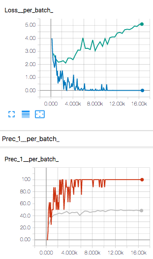
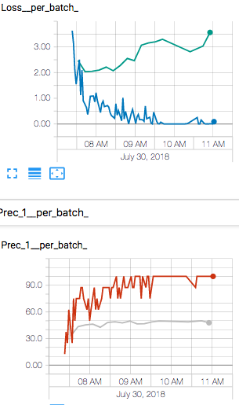

# Vieo Action Recognition

This is our project for building the Video Action Recognition.


## Dataset deployment

Dataset deployment steps：

- Make `video-action-recognition/data` directory.

- Download [HMDB51](http://serre-lab.clps.brown.edu/wp-content/uploads/2013/10/hmdb51_org.rar) to the `data` directory– About 2GB for a total of 7,000 clips distributed in 51 action classes. Add use `unrar x xxx.rar` to extract all .rar file in this dataset. Finally, we have an `video-action-recognition/data` with directory tree structure like this: 

  ```shell
  data
  └── HMDB51
      ├── split
      │   ├── README
      │   ├── testTrainMulti_7030_splits
      │   └── test_train_splits.rar
      └── video
          ├── brush_hair
          ├── cartwheel
          ├── catch
          ...
  ```

- Run `dataset/dataset_list_maker.py` to create annotation list file.

  ```
  python dataset/dataset_list_maker.py data/HMDB51/
  ```

- At last,  `video-action-recognition/data` directory tree structure will be like this:

  ```
  data
  └── HMDB51
      ├── meta.txt
      ├── split
      │   ├── README
      │   ├── testTrainMulti_7030_splits
      │   └── test_train_splits.rar
      ├── test_list.txt
      ├── train_list.txt
      └── video
          ├── brush_hair
          ├── cartwheel
          ├── catch
          ...
  ```


## Model training

Resnet_a models:

- Go to the current directory:`cd xxx/video-action-reconigtion` 
- Run tensorboard: `bash tensorboard/tensorboard.sh [port]`. e.g `bash tensorboard/tensorboard.sh 7788`
- Start training with  `bash experiments/scripts/train_resnet_a.sh`


## Experiments result

> We will show the result in validation dataset.
>
> *v1*: In version 1, we use linear classifier to compute every frames scores, and take meas scores as the sample final scores.

| Model                                                        | Min Loss ( CrossEntropyLoss)            | Max Precision                           | Overfiting Epoch | Graph                                                        |
| ------------------------------------------------------------ | --------------------------------------- | --------------------------------------- | ---------------- | ------------------------------------------------------------ |
| **Resnet50_v1**<br /><br />num_frame=10 <br />lr=1e-4 <br />weight_decay=1e-4 | prec=43.33%<br /><br />loss=2.103<br /> | prec=50.07%<br /><br />loss=4.382<br /> | 6                |  |
| **Resnet101_v1**<br /><br />num_frame=10 <br />lr=1e-4 <br />weight_decay=1e-4 | prec=43.46%<br />loss=2.039<br />       | prec=50.00%<br /><br />loss=3.032<br /> | 5                |  |

